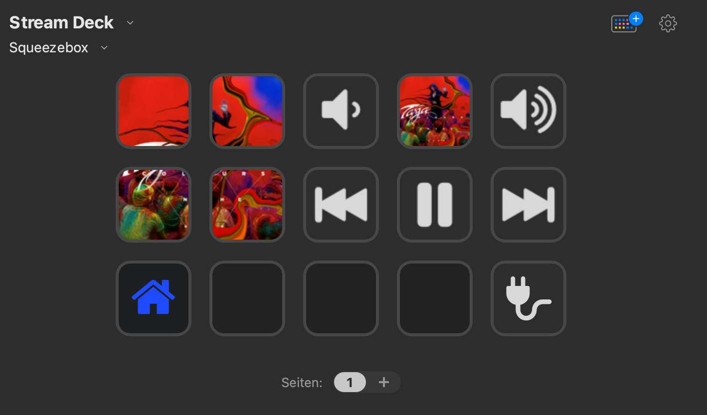
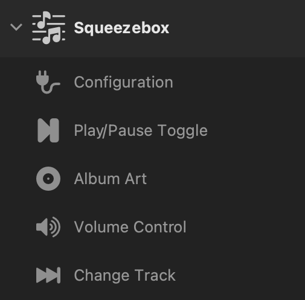

# streamdeck-squeezebox

A simple Stream Deck plugin with actions to control your Squeezebox music players via your local Logitech Media Server (LMS).

* [Stream Deck](https://www.elgato.com/en/stream-deck) (Elgato Product Homepage)
* [Logitech Media Server](https://en.wikipedia.org/wiki/Logitech_Media_Server) (Wikipedia)

## Overview

The following image shows all actions of this plugin in a profile. Most of the actions used more than once, especially the one for album art.

## Features
* Set play mode for a player (toggle pause and play)
* Control the volume of a player (up, down)
* Skip titles forward and back
* Show current album art
* Configuration of streamdeck keys to control specific players
 
## How to use

### Requirements
* Logitech Media Server (LMS) available via local network
* CLI configured on LMS (this is active by default, the standard port is 9090, you can change this in the plugin configuration)

Theoretically, the plugin should work with Steamdeck both on Mac OS and Windows. However, I do not have a Windows 10 machine to test it. Feedback is therefore welcome.

### Installation

Download the current ...streamDeckPlugin file from the releases. 
You install it by a double click on your Windows or macOS machine hosting the STream Deck application.

The plugin and its action appear in the toolbar in the  "Squeezbox" group, see image below.

        

### Configuration

The configuration is done via the corresponding action. Simply drag one into a profile. In the property inspector for the action can be set:

* Hostname of your LMS (name or IP address)
* CLI Port of the LMS (default is 9090)
* HTTP Port of the LMS (default is 9000)

The settings can be tested in the UI with a button. Later on, pressing the action key on the streamdeck also triggers the test and displays the result directly on the device.

If the connection works you can configure a default player. This makes it easier to configure individual actions later.

* Default Player

The settings are saved globally for all actions. In particular, the plugin does not support multiple LMS (yet). 

### Other Actions

**Play/Pause Toggle**

Toggle play mode for a player

**Album Art**

Show the cover art of an album in a tile (1x1, 2x2 or 3x3 Streamdeck keys)

**Volume Control**

Change the volume of a player up or down

**Change Track**

Previous or next track in the playlist of a player

## Implementation details

The plugin is written in Go and uses the [StreamDeck Plugin API bindings for Go](https://github.com/samwho/streamdeck) by Sam Who. Due to a missing feature for global settings, I use a copy in the vendoring directory.
